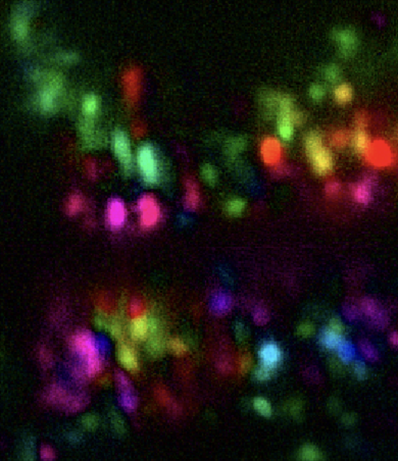
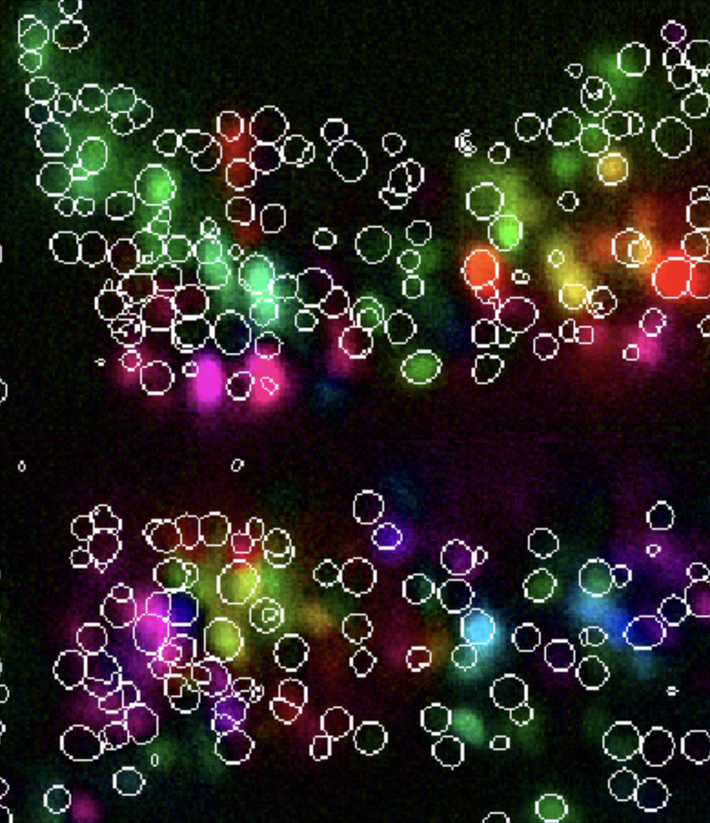
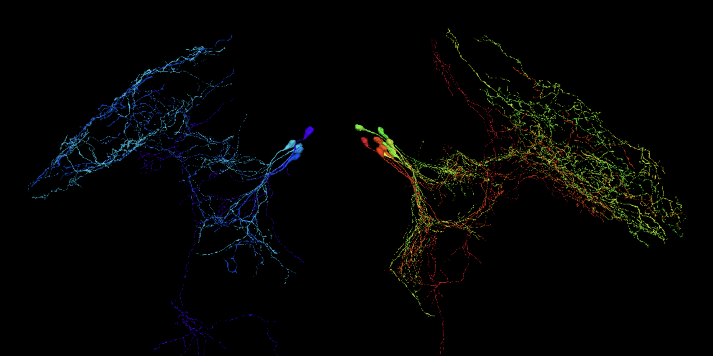
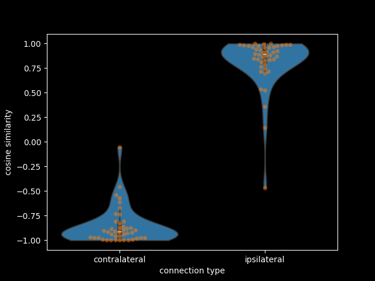
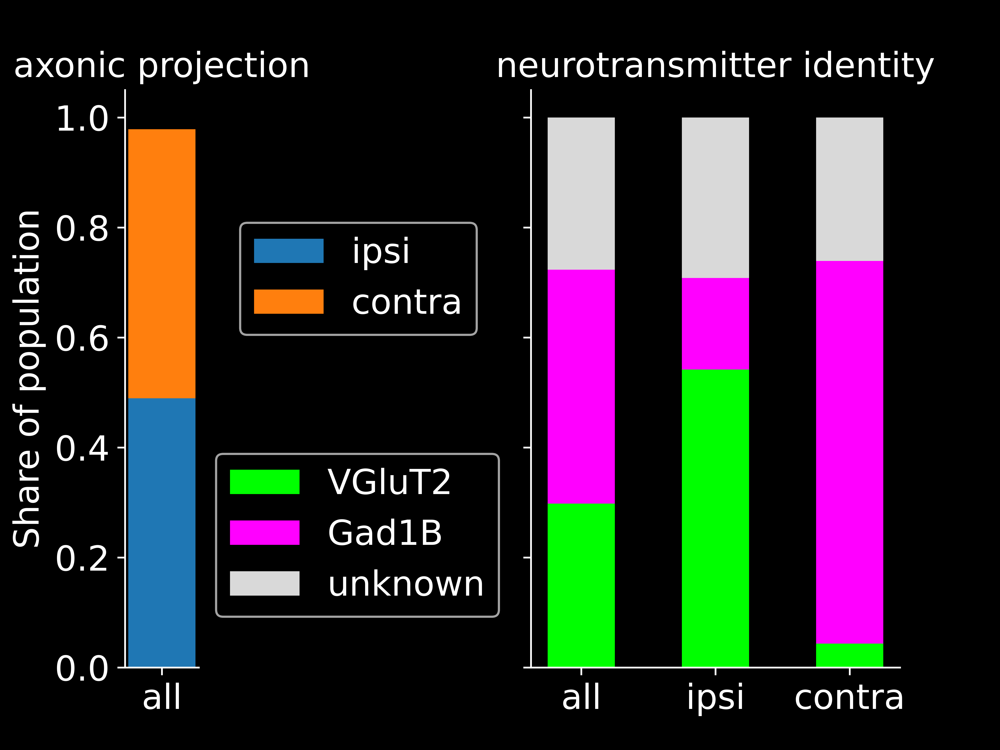

# Direction selective thalamic circuits - Larval zebrafish 

This projects analyses direction selectivity in the zebrafish visual thalamus based on electron microscopy and functional imaging datasets.

## Requirements
- [**Neuprint authorization key**](https://neuprint-fish2.janelia.org/account)
- [**fishFuncEM package**](https://github.com/ahrens-fish-lab/fishFuncEM.git) (private repository - shows 404 without access)

Access must be requested for both. [Section 1](./scripts/1_select_ds_neurons) works without either, [Sections 2](./scripts/2_zap_neurons_to_em_ng) and [3](./scripts/3_contralateral_inhibition) require both

Other packages used are listed in [requirements.txt](requirements.txt)

## Installation
```bash
git clone https://github.com/aljoschamarkus/zapbench_analysis.git
```

```bash
cd zapbench_analysis
pip install -r requirements.txt
```

## Data sets

The data for the analysis in this project is from the following sources, the  Google Storage URIs can be found in [`config.py`](config.py)

- [**ZAPBench**](https://zapbench-release.storage.googleapis.com/landing.html): whole brain functional GCaMP imaging ([published](https://doi.org/10.48550/arXiv.2503.02618), data open source)
  - Stimuli data
  - Aligned activity volume
  - Segmentation of neurons
  - Anatomy
  - Traces of activity for segments
- [**Fish2 EM (neuPrint)**](https://neuprint.janelia.org/): electron microscopy dataset (unpublished, authorization key required)
  - Mece 2 mask (freely available)
  - Segmentation (requires access)
  - Connectivity (requires access)
- [**Fish1 EM (CAVE)**](https://fish1-release.storage.googleapis.com/index.html): electron microscopy dataset ([published](https://doi.org/10.1101/2025.06.10.658982), test data available full dataset requires CAVE account)
  - Segmentation (freely available)
  - Confocal imaging of *vglut2a* / *gad1b* (freely available)

From the above only the segmentation and connectivity data of fish2 requires neuPrint authorization, the rest is available without. Below is a summary specifying data shape, format and units. The driver column contains the driver used for reading the data with [tensorstore](https://google.github.io/tensorstore/).  

| name    | shape             | dimensions       | units                        | driver                   |
|---------|-------------------|------------------|------------------------------|--------------------------|
| Stimuli | 7879x26           | time, channels   | 914 ms, -                    | zarr                     |
| Aligned | 2048x1328x72x7879 | x, y, z, time    | 406 nm, 406 nm, 4 µm, 914 ms | zarr3                    |
| Segmentation | 2048x1328x72      | x, y, z          | 406 nm, 406 nm, 4 µm         | zarr3                    |
|Anatomy|2048x1328x72| x, y, z          | 406 nm, 406 nm, 4 µm|-|
| Traces  | 7879x71721        | time, neurons    | 914 ms, -                    | zarr3                    |
| Mece 2 mask | 3200x1792x641x1   | x, y, z, channel | 512 nm, 512 nm, 480 nm, -    | neuroglancer_precomputed |
| Somas   | 2100x1016x8689x2  | x, y, z, channel | 512 nm, 512 nm, 30 nm, -     | neuroglancer_precomputed |
| Confocal | 2100x1016x8689x2   | x, y, z, channel | 512 nm, 512 nm, 30 nm, -     | n5                       |

## Data directory structure

```
|-fish2
|   |-data
|   |   |-zap_stimulus_turning.h5         (78 KB)
|   |   |-zap_aligned_slices
|   |   |   |-zap_aligned_slice_0.h5
|   |   |   |-[...]
|   |   |-zap_aligned_volume.h5
|   |   |-zap_segmantation.h5             (17.7 MB)
|   |   |-zap_traces.h5                   (332 MB)
|   |   |-zap_direction_selectivity.h5    (2.4 MB)
|   |   |-zap_mece_pretectum.h5           (6.1 MB)
|   |   |-neurons_pretectum.csv           (65 KB
|   |-tiff_stacks
|   |   |-ds_map_custom.tif              (587.5 MB)
|   |   |-ds_map_outlines.tif        (587.5 MB)
|   |   |(-colormapbigfull.tif)           (587.5 MB)
|   |   |(-colormapbigfull_outlines.tif)  (587.5 MB)
|   |-neuron_tables
|   |   |-pretectal_fish1.csv
|   |   |-[...]
|   |-plots
|   |    |-cos_sim.png
|   |    |-[...]
```

## Credits

This analysis pipeline is part of a bigger project about direction selectivity within thalamic circuits in the larva zebrafish visual system.
Most of this work is following up on hypotheses based on the experiments of Sabine Renninger and Ruth Diez del Corral. 
The entire logic behind quantifying direction selectivity is based on Mike Orgers expertise and the direction selectivity colormap is replicated from his implementation, also the coding implementation, especially the cypher queries, are heavily relying on Aaron Ostrovskys knowledge.

## Introduction

In this project previous work in the lab found direction selective neurons in both the pretectum and the thalamus. 
While the pretectal population is rather mixed in the thalamus they make up a topographic map of direction selectivity.
It is known that the flow of visual information in the zebrafish is passed on from the retina by Retinal Ganglion Cells (RGC) to the Arborization Fields (AF) especially AF5 is involved in processing direction selective information ([Kramer et al., 2019](https://doi.org/10.1016/j.neuron.2019.04.018)).

With the availability of a whole brain functional imaging and a corresponding electron microscopy (EM) dataset new opportunities for investigating circuit motifs arise.
Initially a method of determining direction selectivity of neurons was established with the functional imaging, from there on neurons of interest were identified and finally translated into the EM dataset.
There the neuron selection was refined based on morphology and projection patterns. Within the connectome input cells and eventually circuit motives were analysed mostly limited to pretectal populations.
By using direct connectivity alongside direction selectivity information a hypothesis about the sign of ipsi- and contralateral projections could be formed which could then be further supported by neurotransmitter analysis in the fish1 dataset.

### [1. Finding direction selective neurons](./scripts/1_select_ds_neurons) 

To determine direction selectivity the functional imaging during the "Turning" stimulus of ZAPBench was used.
The stimulus consists of sine gratings drifting into the four cardinal directions (open loop).
Every direction was shown for 30s followed by a 30s inter stimulus interval of stationary gratings.
This was repeated 5 times.<br>

The aligned activity volume was divided in 5 time bins combining periods of gratings from a particular direction as well as the inter stimulus interval.
The $\text{response}$ of a voxel towards a directional stimulus was quantified as the mean activity during a time bin subtracted by the mean of the inter stimulus interval bin as a baseline

$$
\text{response}_{\text{dir}} =
\frac{
\sum_{t_{\text{stim}}=1}^{n_{\text{stim}}} \text{activity}_{t_{\text{stim}}}
}
{
n_{\text{stim}}}
-\frac{
\sum_{t_{\text{off}}=1}^{n_{\text{off}}} \text{activity}_{t_{\text{off}}}
}
{
n_{\text{off}}
}$$

From the responses towards the 4 stimulus directions a vector was calculated by subtracting opposing directions in the same dimension.
The direction $\theta$ of the vector encodes the direction of selectivity and its length is the $\text{magnitude}$ of the vector.

$$
\mathbf{v} =
(x, y) =
(
\text{response}_{\text{right}} - \text{response}_{\text{left}},
\text{response}_{\text{forward}} - \text{response}_{\text{backward}}
)
$$

$$
\theta = \mathrm{atan2}(x,y) \bmod 2\pi
$$

$$
\text{magnitude} = \sqrt{x^2 + y^2} $$

Direction selectivity was determined voxel wise for the aligned temporal activity volume and stored in a tiff volume in which the color encoded direction selectivity.
The hue encodes the direction as shown below, the value encodes the magnitude, scaled by the 99th percentile, as a linear function and the saturation was constant at 1.
<br>

$$\text{hue}=(\frac{\theta}{2\pi}+2/6)\bmod 1$$

**Note:** Since the value is scaled by the percentile of direction selectivity magnitude of the voxel population, the colors for the same voxels can slightly vary when the calculation is done on different sub volumes.

<p align="center">
  
  
</p>

For easier selection of ZAPBench neuron segmentations a copy of the tiff volume was stored with white outlines around soma masks from the segmentation dataset.
This was done by subtracting the segment masks from the dilated version of it, to avoid dilation of merged ROIs this was done per segment ID. The resulting outlines were then combined and corresponding voxel colors in the tiff volume are set to white.<br>

Both masks can be loaded into neuroglancer tab that is locally hosted and allows implementing local and nonlocal volumes.
By overlaying the custom direction selectivity map with the ZAPBench segmentation, segments can be selected and IDs copied.

### [2. Analysing neuronal morphology](./scripts/2_zap_neurons_to_em_ng)

After selecting ZAPBench neurons of the desired area and direction selectivity with their IDs their direction selectivity parameters can be extracted directly from the traces dataset.
Direction and color was determined as above but with activity traces of neuron segments instead of voxel brightness.

Since the vector logic above only taking into account the sparse sampling of 4 directions, the vectors can fill a square space with the $x$ and $y$ limits being ±maximum response.
To not over represent the direction selectivity for high responses towards two cardinal directions the vectors were mapped to a circular space to quantify magnitude to represent selectivity more accurately.

$$
r = \max(|x|, |y|)
$$


$$(x_{\text{circ}}, y_{\text{circ}})=(r\sin(\theta), r\cos(\theta))$$

$$
\text{magnitude}_{\text{circ}} = \sqrt{x_{\text{circ}}^2 + y_{\text{circ}}^2} $$

In the neuprint database via cypher query the ZAPBench IDs can be mapped to EM segmentation IDs and additional information such as the side can be extracted.
To analyse morphology the neurons can be loaded and viewed in a clio neuroglancer tab, here the same color coding by direction selectivity is implemented.

With attributes of neurons in the neuprint database, the selection of neurons of interest can be refined taking into account morphology and projection patterns in addition to direction selectivity. 
Here neurons with ipsilateral axonic projections into the tectal neuropil were selected.

The selected population reveals a topographic map of direction selectivity in the thalamus, recreating similar previous findings in the lab. 

<p align="center">
  
</p>

### [3. Analysing circuit characteristics](./scripts/3_contralateral_inhibition)

To analyse the characteristics of the neural connections for a better understanding of the circuit calculations giving rise to direction selectivity, the relation of direction selectivity of connected neurons can be determined.<br>

As potential inputs, based on the Mece 2 Pretectum mask, the IDs of all pretectal neurons were extracted.
For better performance in a first step all neuron IDs were determined, within a bounding box based on the minimum and maximum position of mask voxels, by cypher query in the neuprint dataset.
Afterwards based on position of the neurons soma membership of the pretectal mask was tested, only members were kept.

Another query extracts direct axon to dendrite connections between the listed upstream and downstream neuron IDs. 
In this case with the list of pretectal neurons as upstream neurons and the selection of thalamic neurons of interest as downstream.  

The cosine similarity between the direction selectivity vector of up- and downstream neurons was determined, differentiating between connected neurons of the same side as ipsilateral and of opposite sides as contralateral projections.
A cosine similarity of 1 represents identical, 0 to orthogonal and -1 to opposite direction.

$$\text{cosine similarity}=\frac{A \cdot B}{||A||\text{ }||B||}=
\frac{x_{1_{\text{circ}}}x_{2_{\text{circ}}}+y_{1_{\text{circ}}}y_{2_{\text{circ}}}}
{\sqrt{x_{1_{\text{circ}}}^2+y_{1_{\text{circ}}}^2}\sqrt{x_{2_{\text{circ}}}^2+y_{2_{\text{circ}}}^2}}$$

The distributions reveal similar direction of selectivity for ipsilateral connections between pretectal and thalamic neurons and opposing direction for contralateral connections.
Similar direction selectivity of directly connected neurons indicates excitation while opposing directivity indicates an inhibiting nature of synaptic connection.
The resulting local positive feedback and global negative feedback indicates a winner-take-all motif.

<p align="center">
  
</p>

Unlike for fish2 data for fish1 confocal imaging of genetic labels of *vglut2a* and *gad1b* shows excitatory or inhibitory identity of the neurons.
For a subpopulation of pretectal neurons, that were proofread and selected to have dendritic projections into AF5, the relation of contra- and ipsilateral connections and the neurotransmitter has been quantified.

Though the CAVE database contains information about transmitter identity, the labeling is very sparse and therefore unavailable for most neurons.
After manually determining neurotransmitter identity an automatic readout of neurotransmitter was implemented. 

Neuron IDs of interest were mapped to the corresponding soma segmentation IDs (this can be achieved by CAVE query, code not provided).
The mean brightness of all voxels contained in a soma segment mask was determined for both *vglut2a* and *gad1b*.
The difference over sum ratio of means was used as an excitatory-inhibitory-index $I_{\text{EI}}$.
A threshold was chosen $I_{\text{EI}}$ values above the threshold were classified as excitatory, if below the negative threshold as inhibitory, values smaller than the absolute threshold labeled as undetermined.
With a threshold of 0.4 this method had not a single disagreement with both manual selection and CAVE labels while being more sensitive than the latter. 

$$I_{\text{EI}}=
\frac{\bar{a}_{\textit{glut}}-\bar{a}_{\text{gaba}}}
{\bar{a}_{\text{glut}}+\bar{a}_{\text{gaba}}}$$

The selected popluation of 47 neurons had an almost equal amount of ipsi- and contralateraly projecting neurons.
About a third of these were determined as glutamatergic, GABAergic and unknown respectively, according to automatic classification.
Ipsilateral neurons are mostly glutamatergic with a few GABAergic neurons while contralateral neurons are almost exclusively GABAergic. The fraction of undetermined identity remained similar. 

<p align="center">
  
</p>

## Summary

- A **topographic map of direction selectivity** in the thalamus was recreated from functional imaging, consistent with previous findings in the lab ([Section 1](./scripts/1_select_ds_neurons), [Section 2](./scripts/2_zap_neurons_to_em_ng)).
- Thalamic neurons of interest share a **common morphology and projection pattern** ipsilateral axonic projections into the tectal neuropil supporting their selection as a distinct population ([Section 2](./scripts/2_zap_neurons_to_em_ng)).
- Two independent approaches converge on the same circuit motif: 
  - **Connectivity-based** cosine similarity between up- and downstream direction selectivity vectors shows ipsilateral connections align in direction (excitatory) and contralateral connections oppose (inhibitory).
  - **Neurotransmitter identity** (fish1, *vglut2a*/*gad1b*) independently shows ipsilateral neurons are predominantly glutamatergic and contralateral neurons almost exclusively GABAergic.
  
  Together these indicate a **local positive feedback / global negative feedback motif** underlying direction selectivity in the thalamic circuit ([Section 3](./scripts/3_contralateral_inhibition)).

## Usage

The code used for the above is contained in python scripts in the directory [scripts](./scripts) and is divided in 3 subdirectories.
Each subdirectory is an individual part of the workflow that mostly works independent of the others, while some data is downloaded or generated once and then used across sections.

The [turning stimulus data](./scripts/1_select_ds_neurons/1_create_ds_mask/1_download_stimulus_turning.py) ([section 1](./scripts/1_select_ds_neurons)) is a requirement to extract the relevant time bin of [traces](./scripts/2_zap_neurons_to_em_ng/1_download_traces.py) ([section 2](./scripts/2_zap_neurons_to_em_ng)).
[Direction selectivity data](./scripts/2_zap_neurons_to_em_ng/2_direction_selectivity_traces_new.py) generated from the traces is then also used in [section 3](./scripts/3_contralateral_inhibition).
Within a section the scripts are heavily dependent on each other and are supposed to be run in chronological order indicated by the name prefix. 

The result of one section such as a selection of neurons of interest provides the starting point for the next section. 

In this workflow project [part 1](./scripts/1_select_ds_neurons) works with or without the availability of [**colormapbigfull.tif**](https://drive.google.com/file/d/1ydAAZFxeUDRwJVTQHaeCtv_hAXIT3Az1/view?usp=drive_link) and requires no gated packages or authorization to data sets.
For [part 2](./scripts/2_zap_neurons_to_em_ng) and the first 3 scripts of [part 3](./scripts/3_contralateral_inhibition) both is required, the last 2 scripts of part 3 work without again.

In between sections manual selection of neurons of interest is required or advised.

### Notes

In this workflow required datasets are usually downloaded and then the data is read from the according locally stored HDF5-file.
Depending on the use case the Google storage data (zarr3 format) can also be read directly without storing the data beforehand, as it is done here.

Some analysis parts greatly profit from the usage of code established in the lab that is not provided here. 
In particular the selection of neurons with similar morphology by [NBLAST](10.1016/j.neuron.2016.06.012) clustering as well as getting soma IDs in fish1 from segment IDs which can be achieved by CAVE query.

Code that is used more than once time is defined in functions in [utils.py](./utils.py) and called within the scripts.

### Setup
- Download [**colormapbigfull.tif**](https://drive.google.com/file/d/1ydAAZFxeUDRwJVTQHaeCtv_hAXIT3Az1/view?usp=drive_link) if available.
- Copy [**neuprint authorization key**](https://neuprint-fish2.janelia.org/account) and create a script called **private.py** with the content `AUTH_TOKEN="...your personal auth token..."`.
- Adjust `main_dir = "...your root directory of choice..."` in [config.py](./config.py) to the rootpath where data should be stored.

### [Section 1](./scripts/1_select_ds_neurons) - selecting direction selective neurons

- To generate a voxel based direction selectivity map set `VOLUME_MILITS` in [config.py](config.py) and run all the scripts in [1_create_ds_mask](./scripts/1_select_ds_neurons/1_create_ds_mask) in order.
- To add ZAPBench soma segmentation outlines into the mask run all scripts in [2_add_outlines](./scripts/1_select_ds_neurons/2_add_outlines) in order.
- To load the masks into a neuroglancer tab run [3_mask_to_neuroglancer.py](./scripts/1_select_ds_neurons/3_mask_to_neuroglancer.py) and open the printed link.

Now select ZAPBench somas and copy their IDs based on their direction selectivity. 

#### Notes

Downloading the relevant ZAPBench functional imaging data has a long runtime, but with the availability of [**colormapbigfull.tif**](https://drive.google.com/file/d/1ydAAZFxeUDRwJVTQHaeCtv_hAXIT3Az1/view?usp=drive_link) it can be used instead.
For that the downloaded tiff-file has to be put into the subdirectory `"tiff_stacks"` in the created `main_dir`, this main directory with the relevant is created once [config.py](./config.py) or any script containing `from config import *` is run.
In that case [1_create_ds_mask](./scripts/1_select_ds_neurons/1_create_ds_mask) can be skipped.

Adding outlines helps with manually selecting ZAPBench somas of direction selective neurons but is optional if it is not required [2_add_outlines](./scripts/1_select_ds_neurons/2_add_outlines) can be skipped.

[2_create_ds_map_outlines.py](./scripts/1_select_ds_neurons/2_add_outlines/2_create_ds_map_outlines.py) and [3_mask_to_neuroglancer.py](./scripts/1_select_ds_neurons/3_mask_to_neuroglancer.py) use all available masks created to that point, this can therefor be the created one, the downloaded one or both for [3_mask_to_neuroglancer.py](./scripts/1_select_ds_neurons/3_mask_to_neuroglancer.py) either with or without their corresponding version including outlines.
If no mask is available this script fails.

The color coding in the masks is indicating relative direction selectivity with the value scaled in respect to the voxel with the highest direction selectivity magnitude in the selected volume, therefore the absolute color values of the same voxels for varying `VOLUME_LIMITS` can be different.  

### [Section 2](./scripts/2_zap_neurons_to_em_ng) - show neuron morphology

This analysis part starts with a selection of ZAPBench neuron IDs acquired in the previous [section](./scripts/1_select_ds_neurons) an exemplary selection is provided in `url_fish2_thalamic` in [config.py](./config.py).

[1_download_traces.py](./scripts/2_zap_neurons_to_em_ng/1_download_traces.py) and [2_direction_selectivity_traces_new.py](./scripts/2_zap_neurons_to_em_ng/2_direction_selectivity_traces_new.py) require [1_download_stimulus_turning.py](./scripts/1_select_ds_neurons/1_create_ds_mask/1_download_stimulus_turning.py) to be executed. 

- To get the neuron selection in a clio neuroglancer run all scripts [2_zap_neurons_to_em_ng](./scripts/2_zap_neurons_to_em_ng) in order.
- To use your selection adjust the code to: `df_neurons = ids_to_df_neurons(YOUR_LIST, id_type="zap")` in [3_zap_ids_to_em_ng.py](./scripts/2_zap_neurons_to_em_ng/3_zap_ids_to_em_ng.py).

Afterwards the selection of neurons can be refined for example based on morphology or direction selectivity.

### [Section 3](./scripts/3_contralateral_inhibition) - infer excitatory or inhibitatory character of neurons

This analysis part starts with a selection of fish2 EM neuron IDs acquired in the previous [section](./scripts/2_zap_neurons_to_em_ng) an exemplary selection is provided as `THALAMIC_EM_IDS` in [config.py](./config.py).
The latter part requires a selection of neurons with their ZAPBench soma IDs and an indication of projection pattern as provided in `url_fish1_pretectal` in [config.py](./config.py).

- To plot the cosine similarity between direction of selectivity of pretectal neurons connecting to selected thalamic neurons and the direction of selectivity of selected thalamic neurons run all scripts in [1_cosine_similarity_ds](./scripts/3_contralateral_inhibition/1_cosine_similarity_ds) in order.
- To use your thalamic neuron selection define `THALAMIC_EM_IDS` as a list fish2 EM neuron IDs in [config.py](config.py) or [3_connectivity_matrix](./scripts/3_contralateral_inhibition/1_cosine_similarity_ds/3_connectivity_matrix.py).

**Note:** The pretectum mask might not be perfectly accurate.

- To plot indications of neurotransmitter identity in relation to axonic projection patterns run the scripts in [2_fish1_neurotransmitter_identity](./scripts/3_contralateral_inhibition/2_fish1_neurotransmitter_identity).
- To use your data generate a suitable csv and define `df = pd.read_csv("...path to your CSV...)` in [1_fish1_neurotransmitter.py](./scripts/3_contralateral_inhibition/2_fish1_neurotransmitter_identity/1_fish1_neurotransmitter.py).

The generated plots are stored in the subdirectory `"plots"` in the created `main_dir`.

### [Supplement](./scripts/supplement)

The supplement contains 4 helper scripts:
- [**ds_colorspace.py**](./scripts/supplement/ds_colorspace.py) to plot the colorspace to encode direction selectivity.
- [**minimal_custom_neuroglancer.py**](./scripts/supplement/minimal_custom_neuroglancer.py) a minimal example to open a neuroglancer tab.
- [**visualise_stimulus_encoding.py**](./scripts/supplement/visualise_stimulus_encoding.py) to plot the ZAPBench turning stimulus encoding.
- [**zap_global_ds_percentile.py**](./scripts/supplement/zap_global_ds_percentile.py) to print several percentiles of direction selectivity magnitude with their magnitude value and the number of neurons falling in that percentile of all ZAPBench neurons.

